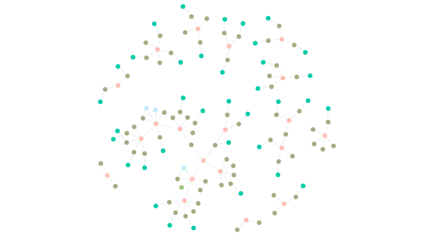
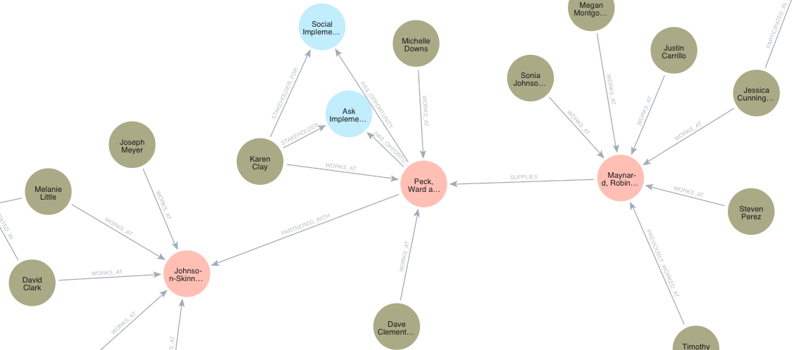

# Knowledge-Graph-CRM

A high-performance Graph-based CRM built with FastAPI and Neo4j, deployed on Azure Web Apps using a fully automated CI/CD pipeline.

[**Explore the API Documentation 🚀**](https://knowledge-crm-fcddcbf6b5f4g9ea.westus3-01.azurewebsites.net/docs)

## Why a Knowledge Graph? (The Graph Advantage)
Unlike traditional relational databases (SQL) that store data in rigid tables, this CRM uses a Knowledge Graph architecture. This allows us to treat relationships as first-class citizens, providing several key advantages:

1. Deep Relationship Discovery
In a standard CRM, asking **"Which contacts are connected to Company A through a former colleague?"** requires complex, slow "JOIN" operations. With a Knowledge Graph, this is a simple path-finding query that executes in milliseconds, regardless of how many millions of records are in the database.

2. Flexible Schema (Agile Data)
Business needs change. With Neo4j, we can add new relationship types (e.g., WORKS_AT, INVESTED_IN, MET_AT_CONFERENCE) on the fly without running heavy migrations or breaking existing code.

3. Visual Intelligence
Knowledge Graphs allow us to map the "Hidden Web" of a business ecosystem. We can visualize:

- Account Hierarchies: Parent companies, subsidiaries, and regional branches.
- Influence Mapping: Who actually holds the decision-making power in a deal?
- Churn Prediction: Identifying "at-risk" accounts by seeing a lack of interaction nodes over time.

4. Semantic Context for AI/LLMs
This setup is RAG-ready (Retrieval-Augmented Generation). By feeding this Graph data into a Large Language Model (LLM), the AI doesn't just see "Company A" as a string of text—it understands Company A's entire network, providing much more accurate and "knowledge-aware" insights.

## CI/CD Workflow
Every push to the main branch triggers a GitHub Action that:

- Builds a new Docker image.
- Pushes the image to Azure Container Registry.
- Deploys the updated container to the Azure Web App without downtime.

## Tech Stack
- Backend: FastAPI (Python 3.11+)
- Database: Neo4j (Graph Database)
- Infrastructure: Azure Web Apps for Containers
- Containerization: Docker
- CI/CD: GitHub Actions

## Security Features
The API is protected with the following security measures:

- API Key Authentication: All POST/PUT/DELETE requests require a valid X-API-KEY in the header.
- SSL/TLS: Enforced HTTPS-only traffic.
- Environment Isolation: No secrets are stored in the code; all credentials (Neo4j, API Keys) are managed via Azure Environment Variables.
- Automated Registry: Container images are privately stored in Azure Container Registry (ACR).

## Roadmap
- [] Frontend Integration
- [] Advanced Graph Analytics Endpoints
- [] Integration of RAG based LLM
